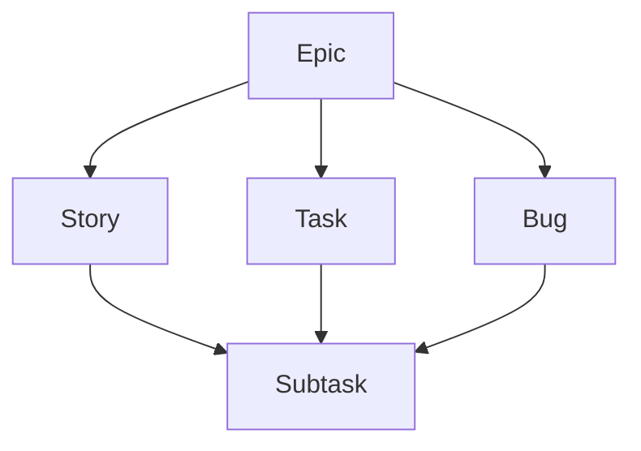

# Contributing

## Documentation

We adapt the [Google documentation guide](https://google.github.io/styleguide/docguide/) and split documentation by audience:

- **`README.md` and `docs/`** (System-level): Features, how components connect, what infrastructure they run on, external dependencies. Nothing implementation-specific.
- **Module READMEs** (Implementation-level): Everything a developer needs to work on that part.

### 1. README.md

The primary entry point and high-level overview of the project.

- **Introduction**: Clear, concise statement of the project's purpose. What problem does it solve? Who is the target audience?
- **Demo**: Visual evidence of the project in action. Placeholders for screenshots, GIFs, or links to live staging/production environments.
- **Features**: High-level bullet points of the core functionality and value propositions.
- **Getting Started**: Link to sub-directory READMEs for detailed technical setup.
- **Documentation**: A directory map for the extended documentation located in the `docs/` folder.
- **Workflow**: Link to contribution guidelines in `CONTRIBUTING.md`.

### 2. docs/ARCHITECTURE.md

System-level source of truth. Contains only what spans the whole system; nothing implementation-specific.

- **Data Flow**: Mermaid diagram showing communication between services.
- **Infrastructure Overview**: Table of layers, technologies, and hosting locations.
- **Project Structure**: Top-level directory tree explaining the purpose of each folder.

### 3. docs/DESIGN.md

Standards for UI, UX, and visual identity.

- **Design System**: Definitions for the color palette, typography, spacing scales, and component library usage.
- **User Flows**: Logical maps or descriptions of the most critical user journeys through the application.
- **Assets**: Markdown illustrations, screenshots, or other visual assets used in the design system.

### 4. docs/API.md

Technical reference for internal and external interfaces.

- **Authentication**: Detailed security protocol. Instructions for obtaining and rotating credentials.
- **Endpoints**: Summary of API resources. Link to interactive documentation if applicable.
- **Data Models**: Schema definitions or descriptions of core domain entities and their relationships.

### 5. [module]/README.md

Technical documentation specific to a project subsystem. All implementation-level detail lives here.

- **Tech Stack**: Versioned list of major languages, frameworks, and libraries.
- **Folder Structure**: Directory layout and module boundary rules.
- **Environment Variables**: List of required keys and `.env.example` reference.
- **Local Development**: Installation steps, runtime requirements and available commands.
- **Code Quality**: Code quality configurations, style guides, and rules.
- **Deployment**: CI/CD pipelines, deployment targets and hosting details.

---

## Issues

We follow the [Jira hierarchy](https://www.atlassian.com/software/jira/guides/issues/overview#what-is-an-work-item) for issues.

### Types

Each issue type has has a provided template.

| Type                                            | Purpose                                |
| :---------------------------------------------- | :------------------------------------- |
| [`Epic`](.github/ISSUE_TEMPLATE/epic.yml)       | A high-level initiative.               |
| [`Story`](.github/ISSUE_TEMPLATE/story.yml)     | A user-facing feature.                 |
| [`Task`](.github/ISSUE_TEMPLATE/task.yml)       | A technical piece of work.             |
| [`Bug`](.github/ISSUE_TEMPLATE/bug.yml)         | A problem which impairs functionality. |
| [`Subtask`](.github/ISSUE_TEMPLATE/subtask.yml) | A granular piece of work.              |

### Hierarchy



### Project Management

| View             | Purpose                                                             |
| :--------------- | :------------------------------------------------------------------ |
| **Backlog**      | A table for prioritizing upcoming stories, tasks, and bugs.         |
| **Sprint Board** | A board for tracking stories, tasks, and bugs in the active sprint. |

| Status        | Description                          |
| :------------ | :----------------------------------- |
| `Todo`        | Issues that are ready to be started. |
| `In Progress` | Issues currently being addressed.    |
| `Done`        | Issues that are completed.           |

| Priority | Description                |
| :------- | :------------------------- |
| `High`   | Critical or urgent issues. |
| `Medium` | Standard priority issues.  |
| `Low`    | Non-urgent issues.         |

### Title

Issue titles follow the commit summary style but omit prefixes and use sentence case. See [Commits](#commits) for details.

---

## Branches

We follow the [Conventional Branch](https://conventional-branch.github.io/) specification.

### Pattern

```text
<type>/[ticket-id]-<description>
```

### Types

| Type       | Usage                |
| :--------- | :------------------- |
| `feature/` | New features         |
| `bugfix/`  | Bug fixes            |
| `hotfix/`  | Urgent fixes         |
| `release/` | Release preparations |
| `chore/`   | Maintenance tasks    |

### Rules

- Lowercase only
- Hyphen-separated
- Concise descriptions

---

## Commits

We follow the [Conventional Commits](https://www.conventionalcommits.org/en/v1.0.0) specification.

### Pattern

```text
<type>[optional scope][optional !]: <description>

[optional body]

[optional footer(s)]
```

### Types

| Type       | Release | Description                 |
| :--------- | :------ | :-------------------------- |
| `fix`      | PATCH   | Bug fix                     |
| `feat`     | MINOR   | New feature                 |
| `build`    | -       | Build system changes        |
| `chore`    | -       | Maintenance / Tooling       |
| `ci`       | -       | CI configuration            |
| `docs`     | -       | Documentation               |
| `style`    | -       | Formatting (no code change) |
| `refactor` | -       | Code change (no feat/fix)   |
| `perf`     | -       | Performance improvement     |
| `test`     | -       | Adding/correcting tests     |
| `revert`   | -       | Reverts a previous commit   |

### Rules

- **Imperative**: Use the imperative mood (e.g., `add` not `added`).
- **Formatting**: Lowercase start and no trailing period.
- **Breaking**: Append `!` to type/scope or include `BREAKING CHANGE:` footer for MAJOR version update.

---

## Pull Requests

We adapt the [Gitmore PR Template](https://gitmore.io/blog/pull-request-template).

### Title

PR titles follow the commit summary style. See [Commits](#commits) for details.

### Description

Use the provided [template](.github/PULL_REQUEST_TEMPLATE.md).
