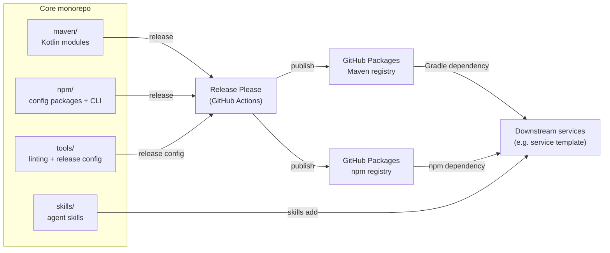

# Architecture

System-level source of truth for Core. Contains only what spans the whole
repository; implementation detail lives in each subsystem's README.

## Data Flow

Core is built and published from a single monorepo. Release Please cuts versioned
releases, the matching artifacts are published to GitHub Packages, and downstream
repositories consume them.



## Infrastructure Overview

| Layer             | Technology                                    | Hosting                          |
| :---------------- | :-------------------------------------------- | :------------------------------- |
| Backend libraries | Kotlin 2.4 · Gradle 9.6 · Spring Boot 4.1     | GitHub Packages (Maven registry) |
| Frontend configs  | PNPM 11.9 · TypeScript 5 · ESLint 9 · Turbo 2 | GitHub Packages (npm registry)   |
| Tooling configs   | PNPM 11.9 · markdownlint-cli2 · commitlint    | `tools/` (not published)         |
| Agent skills      | Markdown `SKILL.md`                           | GitHub repository (`skills add`) |
| CI/CD             | GitHub Actions · Release Please               | GitHub-hosted runners            |

## Project Structure

```text
.
├── maven/      # Kotlin backend modules and the Gradle convention plugin
├── npm/        # frontend configuration packages and the API CLI
├── tools/      # shared linting configs, commitlint, and release-please config
├── skills/     # agent skills
├── docs/       # system-level documentation
└── .github/    # CI/release workflows and issue/PR templates
```
